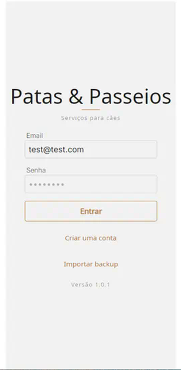
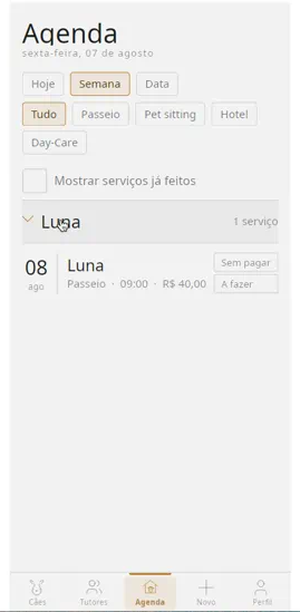
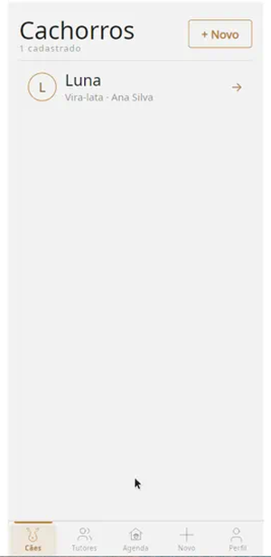
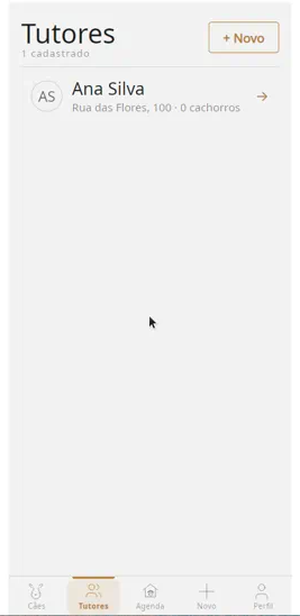
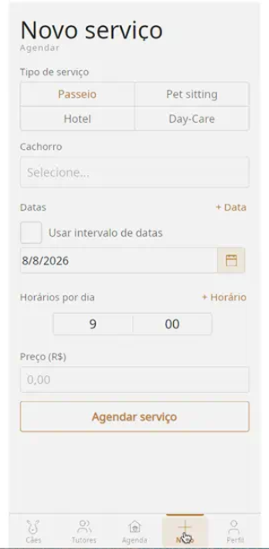
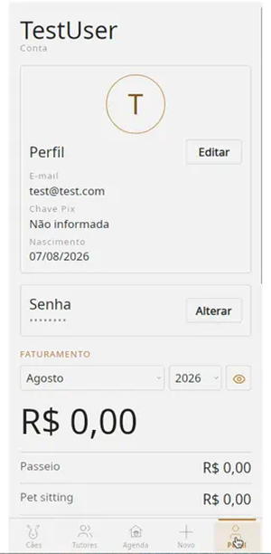

<div align="center">

# Patas & Passeios

**Serviços para cães** — a cross-platform business app for a working dog sitter,
built in .NET 10 and Avalonia over Dapper/SQLite.



**139 C# files · ~16,500 lines · 180 tests · five platform heads from one View**

</div>

Built for one real user running a real pet-care business in Santos, Brazil —
not a product and not for sale. That constraint shaped it: no server, no
account system to administer, no subscription, and a local SQLite file the
owner can back up and carry. Every feature exists because the business needed
it, which is a different design pressure from a portfolio project and shows up
throughout — particularly in the money handling.

Identifiers, comments and docs are English; the UI is Brazilian Portuguese.

> **The repository name is historical.** It began as an exercise to learn
> [Dapper](https://github.com/DapperLib/Dapper) and kept the name after it
> became the application it is now.

---

## What it does

**Patas & Passeios** runs the day-to-day of the business:

| Area | What you can do |
| --- | --- |
| **Agenda** | Browse walks, sitting, hotel and day-care by day / week / month, filter by type, open a booking |
| **Cães / Tutores** | Register dogs and tutors, photos, breed, address, phone |
| **Novo serviço** | Book passeio, pet sitting, hotel (with optional extra charge) or day-care |
| **Pagamentos** | Record payments on the tutor screen — the ledger settles services and banks leftover as credit |
| **Perfil** | Income by month/type, Pix key, password, PNG month summary, backup export/import |
| **Extras** | Mark work as done, export a booking to Google Calendar, hide money figures |

Payment is **not** toggled on the agenda. Paid/unpaid tags there are display-only; money is entered from the tutor detail screen.

Seeded demo login: `test@test.com` / `8998`.

---

## Screens

<p align="center">
  
  
  
  
  
</p>

<p align="center">
  
  &nbsp;
  
  &nbsp;
  
</p>
<p align="center">
  <em>Agenda · Cães · Tutores</em>
</p>

<p align="center">
  
  &nbsp;
  
</p>
<p align="center">
  <em>Novo serviço · Perfil / faturamento</em>
</p>

### Tabs

1. **Cães** — dog list; open a dog for photo, tutor, description and bookings.
2. **Tutores** — tutor list; open a tutor for contact details, dogs, unpaid bill, payment history and “registrar pagamento”.
3. **Agenda** — upcoming (and optionally past) services, grouped by dog, with paid/done status tags.
4. **Novo** — create a service for a dog (passeio, pet sitting, hotel, day-care).
5. **Perfil** — account, password, monthly income breakdown, reports and backup.

Login / sign-up and restore-from-backup sit outside the tab shell.

---

## Tech stack

- **.NET 10** (`net10.0`) · **Avalonia 12.1.1** UI
- **Dapper** + **SQLite** (local DB per install)
- Custom DI / MVP navigation from the **AvaloniaFramework** git submodule
- Heads: **Desktop** (Windows/Linux), **MacOS**, **iOS**, **Android** over the same View

```
Repository.Dapper  →  Viewmodel  →  View  →  Infrastructure  →  Desktop / Mac / iOS / Android
                              ↑
                   AvaloniaFramework (submodule)
```

---

## Domain model (as implemented)

Schema names win over older “Client” wording — the code uses **Tutors** / **PetSitterTutors**.

```
PetSitter ──┬── PetSitterTutors ── Tutors ── Dogs
            │                         │
            ├── WalkingService ───────┤
            ├── PetSittingService ────┤
            ├── PetHotelService ──────┤  (+ ExtraCharge, RequiresWalking)
            ├── DayCareService ───────┤  (+ RequiresWalking)
            │                         │
            └── TutorPayments ────────┘
                    └── TutorPaymentAllocations  (Kind + ServiceId)
```

Each service row carries independent **`ServiceDone`** (work happened) and **`ServicePaid`** (money settled) flags, plus settlement columns (`AmountSettled`, `CreditApplied`). Hotel total = nights × daily rate + extra charge. Tutor **credit** is spent automatically when new bookings are created.

---

## Getting started

```bash
git clone --recursive https://github.com/sebasortiz1989/PatasePasseios.git
cd PatasePasseios

# if the clone was not recursive:
git submodule update --init --recursive

cd DapperDemo                  # the solution dir kept its old name
dotnet build app/PatasePasseios.Desktop/PatasePasseios.Desktop.csproj
dotnet run --project app/PatasePasseios.Desktop/PatasePasseios.Desktop.csproj
dotnet test tests/Tests.Dapper/Tests.Dapper.csproj
```

### Demo data

The app starts empty apart from the seeded login, which makes every screen look
like nothing works. To fill it:

```bash
Scripts/seed-demo.sh          # run the app once first, so the schema exists
```

Four tutors, eight dogs, and 22 services across all four types — settled, done
but unpaid, and upcoming — plus one tutor carrying credit so the payment ledger
is visible rather than theoretical. Dates are generated relative to today, so
the agenda always straddles now. It **deletes every record** in the target
database and asks before doing it; never point it at real data.

Prefer building the **Desktop** head on Linux/CI: the iOS/Android/MacOS projects need mobile workloads a plain SDK image does not have. Stop a running head before rebuilding — it locks `bin/` (`MSB3027` / `MSB3021`).

---

## Repository layout

```
<repo>/
  README.md                 ← this file
  CLAUDE.md, .claude/skills/  ← agent guidance
  images/                   ← logo, tab icons, README screenshots
  external/AvaloniaFramework/   ← git submodule
  DapperDemo/
    src/Repository.Dapper/  ← SQLite schema, DTOs, repositories, backup
    app/PatasePasseios.Viewmodel/
    app/PatasePasseios.View/    ← .axaml screens (pt-BR)
    app/PatasePasseios.Infrastructure/
    app/PatasePasseios.Desktop|MacOS|iOS|Android/
    tests/Tests.Dapper/     ← data-layer tests
```

Deep topic notes live under `.claude/skills/`: navigation, schema, money/payments, backup, styling canvas, Avalonia docs connector.

---

## Engineering notes

The decisions worth reading the code for.

**Done and paid are independent.** `ServiceDone` (the walk happened) and
`ServicePaid` (the money settled) are separate columns on every service row,
because in the real business they genuinely come apart — a dog gets walked all
week and the tutor pays on Friday. Collapsing them into one status was the
first design that got thrown away.

**Payment is a ledger, not a flag.** A tutor pays an amount, not an invoice.
`TutorPayments` → `TutorPaymentAllocations` settles that amount across
outstanding services and banks the remainder as credit, which is then spent
automatically against the next booking. `AmountSettled` and `CreditApplied`
make each service row say how it was paid rather than merely that it was.

**Payment cannot be toggled from the agenda.** Deliberate. Money is entered
only from the tutor screen where the balance is visible; the agenda's paid tags
are display-only. A one-tap "paid" on a list is how a ledger silently loses
track of an amount.

**The master password is a documented trade, not an oversight.**
`RepositoryPetSitter` accepts a constant master password on any account, and
the code says why in full: this is a local-only app with no server and no
password reset, so the alternative to a recovery key is a business losing its
records. It is compared in the clear because hashing it would change nothing —
the hash and the value that verifies it would ship in the same binary. Read the
remarks block before judging it; the reasoning is the point.

**One View, five heads.** Desktop, macOS, iOS and Android share a single
Avalonia View layer and Viewmodel, with platform-specific dependency
inversion at each head.

---

## References

- [Dapper](https://github.com/DapperLib/Dapper)
- [Avalonia](https://avaloniaui.net/)
- [Dapper tutorial](https://dappertutorial.net/online-examples) · [learndapper.com](https://www.learndapper.com/non-query)
